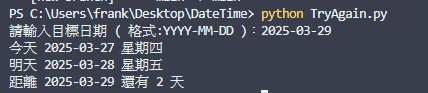
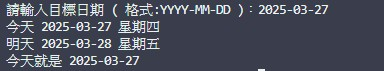
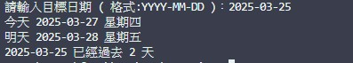

⭐datetime 庫練習

簡介:

這是一個使用datetime庫的練習
    ．日期格式轉換
    ．計算日期差距
    ．換算星期幾
    ．使用 deltatime 做天數增減

功能使用說明:

輸入目標日期 ( 格式:YYYY-MM-DD )
輸出今天 星期幾、明天 星期幾
目標日期距離今天幾天 ( 包含過去、今天、未來 )

✔️datetime  ✔️deltatime 





專案結構:

```
ExchangeAPI
    ├─ DateT.py (模仿版本 - 初版練習)
    ├─ TryAgain.py (獨立重試)
    └─ README.md (程式簡介)
```

使用方法:

( Git Clone用網址 https://github.com/Frank-Pon/Interview_project.git ) clone之後 -> 在終端機輸入 python DateT.py -> 輸出今天、明天及距離目標日期✅


專案學習心得:

以前只用過datetime的strftime這個函式

對其他的函式比較陌生

這次的練習對於datetime庫的理解又加深了不少

這個庫在專案上非常常見

在熟練了之後對於開發也是非常有幫助

因此這次挑了這個庫來深入學習。